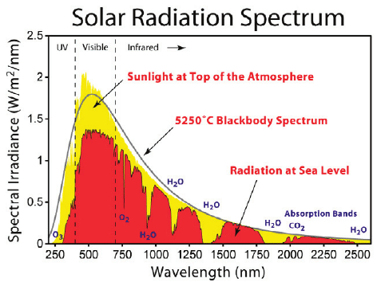
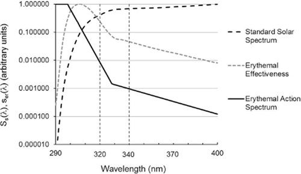
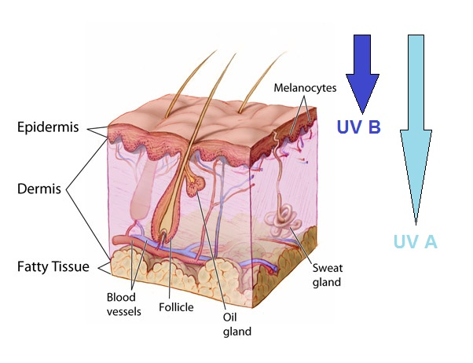
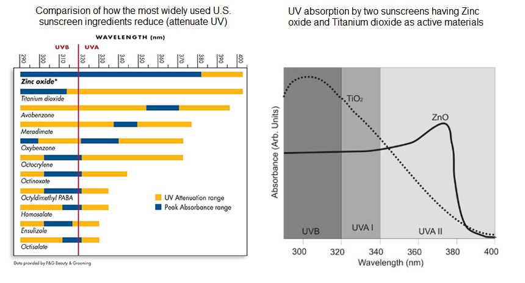
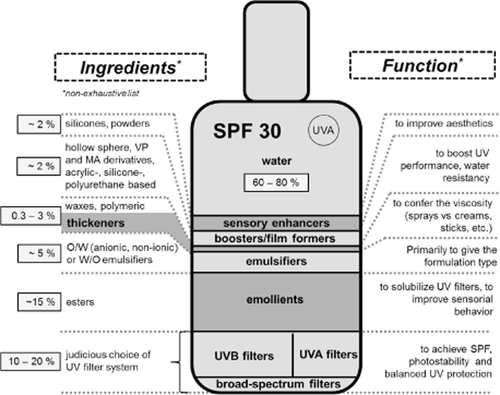
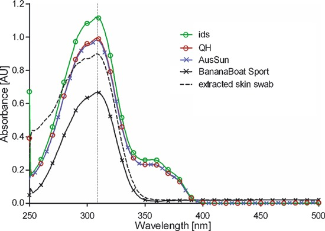
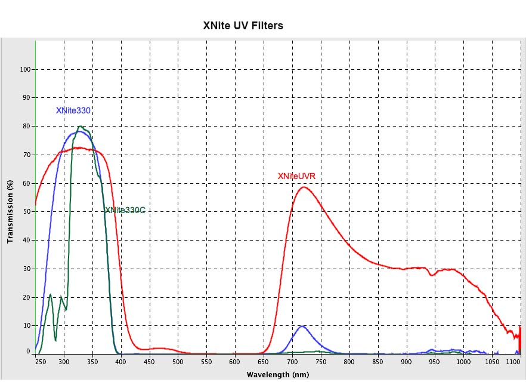
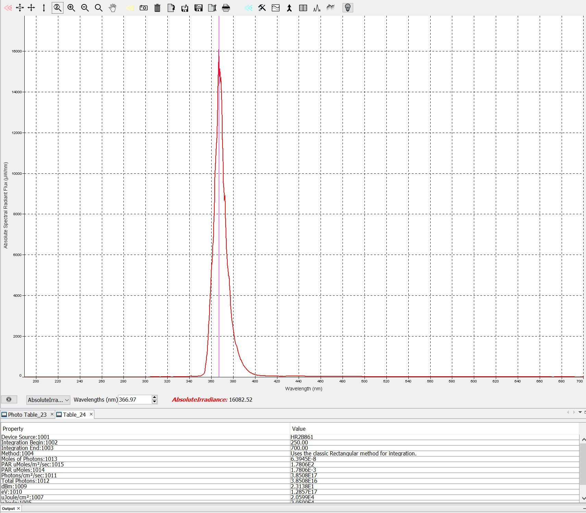

# Sunscreen Notes

Notes towards setting up a UV camera to evaluate sunscreen coverage.

Main questions:
* Which frequencies of electromagnetic radiation are emitted from the sun, and make it through the atmosphere?
* Which frequencies cause skin damage?
* Which frequencies are absorbed (or reflected) by various types of sunscreen?
* Which frequencies are detectable by UV cameras?

---

## Illumination Bands

Which frequencies are emitted from the sun, and make it through the atmosphere?

--- 

> UV is generally divided into three sub-bands:
> 
> * UVA, or near UV (315–400 nm)
> * UVB, or middle UV (280–315 nm)
> * UVC, or far UV (180–280 nm)
> 
> No measurable UVC from solar radiation reaches the Earth's surface.

https://www.livescience.com/50326-what-is-ultraviolet-light.html#:~:text=Ultraviolet%20(UV)%20light%20falls%20in,%C3%97%2010%E2%88%927%20inches).

---

https://www.researchgate.net/figure/Solar-spectrum-at-the-top-of-the-atmosphere-and-at-sea-level-1_fig1_271891094

---
**Summary**: UV radiation at sea level is present from about 280nm to 400nm, with increasing strength at longer wavelengths.

---

## Sensitivity Bands

Which frequencies cause skin damage?

--- 

> UVB rays are more efficient in causing erythema. On the other hand, the absolute amount of UVA-I (340–400 nm) radiation is much higher than UVA-II (320–340 nm) and UVB (290–320 nm). Therefore, UVA-I contributes substantially to erythema. Multiplication of the two curves leads to the erythemal effectiveness spectrum which spreads over the whole range of UV radiation.

https://onlinelibrary.wiley.com/doi/full/10.1111/phpp.12112

--- 

UVA penetrates deeper into the skin

---

Carcinogenicity of UVA vs UVB:

> Although UVA is generally far less carcinogenic than UVB radiation, it is present more abundantly in sunlight than UVB radiation (> 20 times radiant energy) and can, therefore, contribute appreciably to the carcinogenicity of sunlight."

UVB causes direct photochemical damage to DNA, while UVA is absorbed by other molecules, for instance generating reactive oxygen species which damage DNA membranes.

https://pubmed.ncbi.nlm.nih.gov/10907526/

--- 

**Summary** - UVB causes more skin damage, but UVA radiation is stronger. Net result is that the whole UVA+UVB range is damaging.

---

## Sunscreen Absorbtion Bands

Which frequencies are absorbed (or reflected) by various types of sunscreen?

There are various chemical components that can be used together in a single sunscreen formulation:

---
UV attenuation of common sunscreen ingredients:

https://ninithi.wordpress.com/2015/07/31/beating-the-summer-uv-with-nano-sunscreens-critical-points-to-know/

---
The UV filters above are combined with other ingredients to make a sunscreen product:

https://onlinelibrary.wiley.com/doi/full/10.1111/phpp.12112

---

Resultant absorbtion spectra depend on particular sunscreen formulation

E.g. absorbtion spectra for four commercial sunscreens, showing peak absorbtion around 309nm.

https://www.researchgate.net/publication/47427998_A_New_Method_to_Quantify_the_Application_Thickness_of_Sunscreen_on_Skin

---

**Summary:** Commercial sunscreens (at least those shown above) exhibit absorbtion across the full UVA+UVB band, with peak absorbtion around 309nm.

---

## Camera Sensitivity Bands

Which frequencies are detectable by UV cameras?

---

Entry-level UV camera:

"With stock lens, camera can see from about 365nm to 380nm."

Spectral responses of various UV filters from https://www.maxmax.com:

Spectral output of maxmax XNiteFlashF Series 365nm illuminator:

It appears the above camera/illuminator combination will only be capable of imaging UVA. UVB imaging likely requires a more sophisticated setup.

https://www.maxmax.com/shopper/product/15903-xniteusb2s-uv-usb-2-0-megapixel-hd-monochrome-camera-uv-only/category_pathway-9506

https://www.maxmax.com/shopper/product/16003-xniteflashf-365-3w-xniteflashf-housing-with-a-365nm-3-watt-uv-led/category_pathway-9524

---

Off the top of my head, factors that affect UV sensitivity:

* Lens: glass lenses attenuate UV. Quartz lenses are preferred
* Color filter array / microlenses: these attenuate UV - prefer monochrome cameras
* Optical filter stack: want to pass UV and block all other bands
* Image sensor: I presume different sensor types would have different sensitivities

TODO: expand the above, support with sources.

---

## Conclusions

* When using the camera indicated above:
    * If using the 365nm illuminator in an otherwise dark room, then I expect only 365nm light to be observable.
        * From the sunscreen absorbtion specra above, I expect sunscreen to be noticably dark at this wavelength, although the effect would probably be more pronounced with a setup for imaging down to 300 nm. 
        * Look for sunscreens with more UVA filtering components for a more pronounced effect. Something zinc-oxide based would likely show up well.
    * When in sunlight
        * the longer UVA wavelengths will also be visible, however sunscreen absorbtion is typcially less at these wavelengths, so sunscreen will likely be less visible.
        * Additionally IR leakage may be an issue reducing the visibility of sunscreen. Worth a try, but a better camera may be required for good results.

